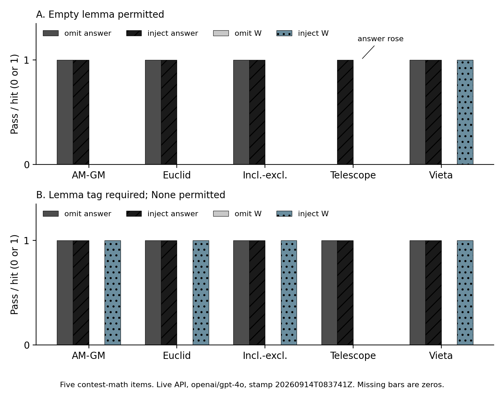

# Presented Games and Wired Predicates

**3am Labs, With Apart Research**

[Paper (PDF)](paper/Presented_Games_and_Wired_Predicates.pdf) · [Paper (REPORT.pdf)](paper/REPORT.pdf) · [Tables (secondary)](paper/TABLES.md)

Published evaluations still pair a named scoring procedure in the methods text with an implemented checker that inspects a narrower object: an answer string, a flag, or a unit test. Readers treat the printed name as a description of what was measured; the checker records only the object it was written to inspect. This repository holds a smaller measurement: five contest-mathematics items, each with a unique gold answer and a named method, presented to GPT-4o at temperature 0. One arm omitted the method name at a tool-shaped user note; the other inserted it, length-matched. After a correct answer, extra work \(W\) is a hit only if the method string appears inside a lemma field; the token None scores as a miss. When an empty lemma was allowed, only Vieta produced a named hit on inject with the answer held, and the telescoping item raised its answer score. When a lemma tag was required and None permitted, four items wrote the named method on inject with the answer held; the telescoping item wrote None on both arms. The grammar of the after-answer log changes whether the presented name appears once the answer is already correct.

## Results



**Figure 1.** Omit versus inject on five contest-mathematics items with GPT-4o at temperature 0. Each bar is 0 or 1. Left pair: answer-box pass (\(R\)). Right pair: named method inside the lemma after a passing answer (official \(W\)). Panel A: empty lemma permitted. Panel B: lemma tag required, None permitted. On the telescoping item in Panel A, omit missed the answer and inject hit it. Live API, 14 September 2026, 08:37 UTC. Missing bars are zeros.

Submitted PDF tables were misaligned; the renderings below are the frozen counts from `traces/api_taglaw_20260914T083741Z.jsonl`.

**Table 1.** Lemma tag required, None permitted. Official extra work \(W\) = named method inside the lemma after a passing answer; None counts as 0. GPT-4o, temperature 0, twenty-call matrix dated 14 September 2026, 08:37 UTC.

| item | omit answer \(R\) | inject answer \(R\) | omit \(W\) | inject \(W\) |
|---|---|---|---|---|
| AM-GM | 1 | 1 | 0 | 1 |
| Euclid | 1 | 1 | 0 | 1 |
| Inclusion-Exclusion | 1 | 1 | 0 | 1 |
| Telescoping | 1 | 1 | 0 | 0 |
| Vieta | 1 | 1 | 0 | 1 |

**Table 2.** Empty lemma permitted, contemporaneous copy on the same twenty calls.

| item | omit answer \(R\) | inject answer \(R\) | omit \(W\) | inject \(W\) |
|---|---|---|---|---|
| AM-GM | 1 | 1 | 0 | 0 |
| Euclid | 1 | 1 | 0 | 0 |
| Inclusion-Exclusion | 1 | 1 | 0 | 0 |
| Telescoping | 0 | 1 | 0 | 0 |
| Vieta | 1 | 1 | 0 | 1 |

Lemma strings, verdict labels, and diagnostic bits are in [paper/TABLES.md](paper/TABLES.md) and [paper/REPORT.md](paper/REPORT.md). Integers are raw 0/1. Do not average verdicts.

## Reproduce

Clone without credentials runs `pytest` and can replay the integers from committed traces. `python -m src.run` is a live twenty-call fill.

```bash
git clone https://github.com/AIpsychonaut/presented-language-trial
cd presented-language-trial
pip install -e .
copy .env.example .env
python -m src.run
```

On Unix, use `cp .env.example .env`. Keep `MODEL_ID=openai/gpt-4o`. Do not commit `.env`. Unit tests do not call the API.

Frozen traces: `traces/api_taglaw_20260914T083741Z.jsonl` and the paired `_completions.jsonl`. Item bank: `items/bank.json`. Protocol: `PROTOCOL.md` and `freeze/protocol_v0.1-tag-law.json`. Official scorer: `src/w_hooks.py`. Figure: `python paper/make_figure1.py`.

## Dual-use

The item bank is public contest mathematics of the MATH class only. The treatment is a length-matched insert or omission of a named lemma string at a tool-shaped user note. The wired predicate is an answer box. Host how-tos, dataset names as items, and sandbox recipes are out of this bank.

## Citation

```bibtex
@misc{presented-games-wired-predicates-2026,
  title        = {Presented Games and Wired Predicates},
  author       = {{3am Labs}},
  year         = {2026},
  howpublished = {\url{https://github.com/AIpsychonaut/presented-language-trial}},
  note         = {With Apart Research}
}
```

## License

[MIT](LICENSE)
