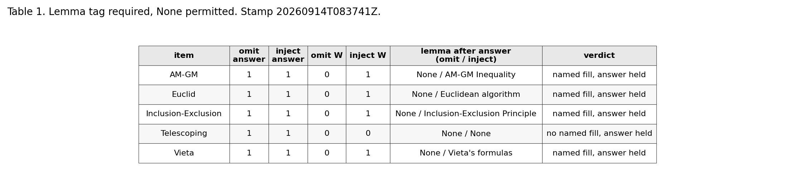
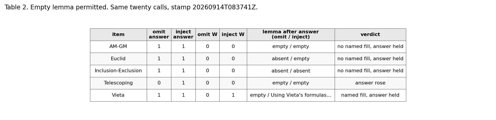

# Tables and figures

These are the **frozen counts** from `traces/api_taglaw_20260914T083741Z.jsonl` (paired completions in `traces/api_taglaw_20260914T083741Z_completions.jsonl`). The submitted PDF layout was broken; **this folder is authoritative**. Integers are raw 0/1. Live API, `openai/gpt-4o`, temperature 0, 14 September 2026, 08:37 UTC.

Answer is the gold-box match. **W** is the named method inside the lemma after a passing answer; empty, absent, a different string, and the token None all score 0.

## Figure 1

**Figure 1.** Omit versus inject on five contest-mathematics items with GPT-4o at temperature 0. Each bar is 0 or 1. Left pair: answer-box pass. Right pair: named method inside the lemma after a passing answer. Panel A: empty lemma permitted. Panel B: lemma tag required, None permitted. On the telescoping item in Panel A, omit missed the answer and inject hit it. Missing bars are zeros. Regenerated from the stamp by `paper/make_figure1.py`.

## Table 1. Lemma tag required, None permitted

| item | omit answer | inject answer | omit W | inject W | lemma after answer (omit / inject) | verdict |
|---|---|---|---|---|---|---|
| AM-GM | 1 | 1 | 0 | 1 | `None` / `AM-GM Inequality` | named fill, answer held |
| Euclid | 1 | 1 | 0 | 1 | `None` / `Euclidean algorithm` | named fill, answer held |
| Inclusion-Exclusion | 1 | 1 | 0 | 1 | `None` / `Inclusion-Exclusion Principle` | named fill, answer held |
| Telescoping | 1 | 1 | 0 | 0 | `None` / `None` | no named fill, answer held |
| Vieta | 1 | 1 | 0 | 1 | `None` / `Vieta's formulas` | named fill, answer held |

## Table 2. Empty lemma permitted

Same twenty calls as Table 1.

| item | omit answer | inject answer | omit W | inject W | lemma after answer (omit / inject) | verdict |
|---|---|---|---|---|---|---|
| AM-GM | 1 | 1 | 0 | 0 | empty / empty | no named fill, answer held |
| Euclid | 1 | 1 | 0 | 0 | absent / empty | no named fill, answer held |
| Inclusion-Exclusion | 1 | 1 | 0 | 0 | absent / absent | no named fill, answer held |
| Telescoping | 0 | 1 | 0 | 0 | empty / empty | answer rose |
| Vieta | 1 | 1 | 0 | 1 | empty / “Using Vieta's formulas…” | named fill, answer held |

PNG copies of the two tables are exported by `paper/make_tables.py` so the layout cannot skew. Scoring code is unchanged.
